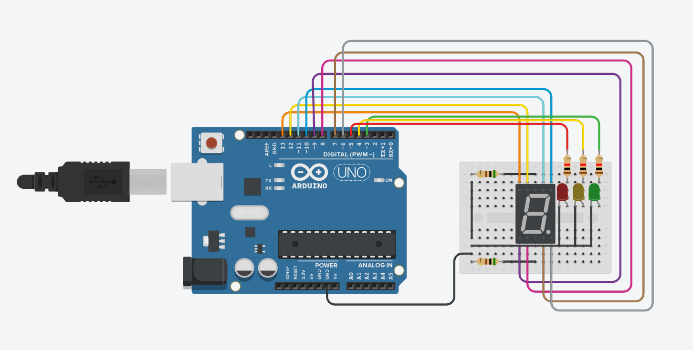
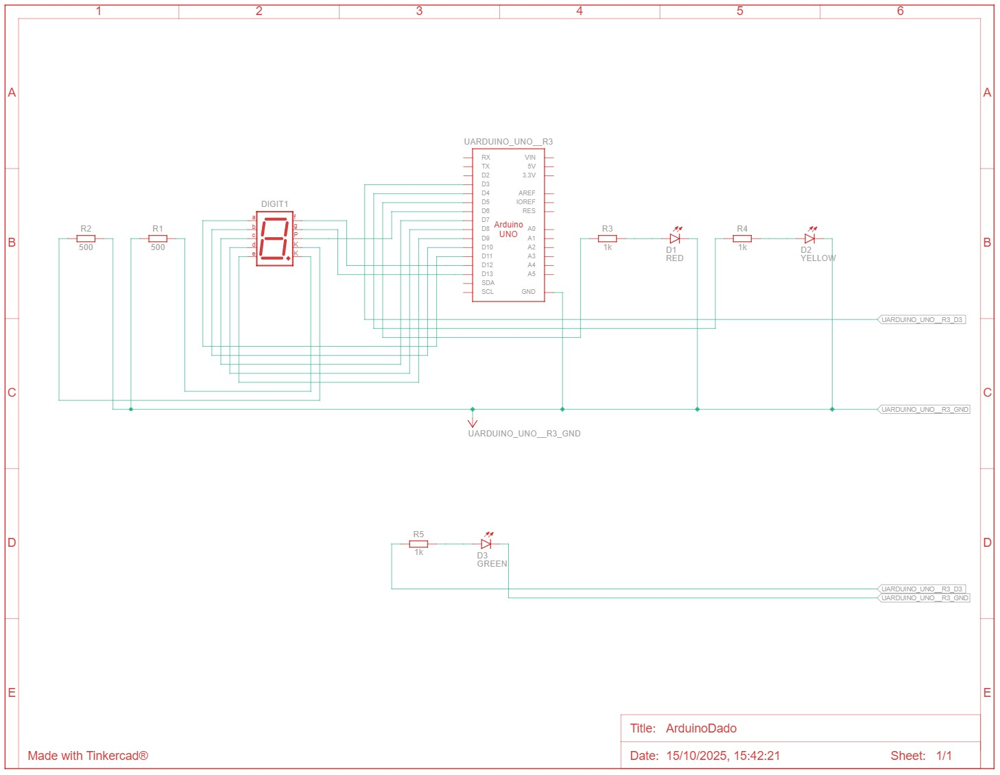
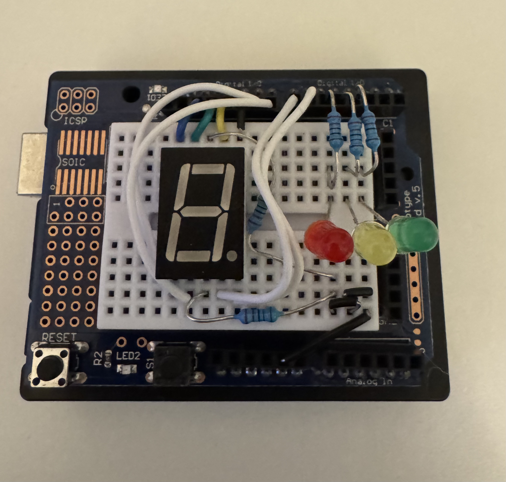

# 🎲 Progetto: Simulatore di dado con LED su Arduino 💡

## 📋 Descrizione
Questo progetto è uno sketch Arduino che simula il lancio di un dado a 7 facce (numeri da 0 a 6).

Il dado viene "lanciato" generando un numero casuale e visualizzandolo tramite un display 7 segmenti ai pin digitali della scheda. Prima della visualizzazione del risultato, si accende una sequenza di LED che rappresenta un conto alla rovescia, segnalando il momento imminente dell'uscita del nuovo numero.

Il codice utilizza funzioni dedicate per accendere i LED in configurazioni diverse, corrispondenti ai numeri da 0 a 6.

Il funzionamento dettagliato del codice si trova nella sezione apposita.

## 🔌 Schema circuitale, elettrico e topografico  
Schema circuitale
 
Schema elettrico
  
Schema topografico

## 📄 Licenza  
Questo progetto é protetto dalla licenza Apache License 2.0. Guarda il file LICENSE per ulteriori dettagli. Sentiti libero di usarlo, modificarlo e condividerlo.

Disclaimer: L'autore declina ogni responsabilità per qualsiasi danno diretto o indiretto, perdita di dati o uso improprio derivante dall'utilizzo di questo software. Usalo a tuo rischio.

---

## 🚀 Come usare

Materiali necessari
Scheda Arduino (uno qualsiasi modello compatibile)

Display 7 segmenti

3 LED per il conto alla rovescia

Resistenze (circa 220Ω o 330Ω per limitare la corrente ai LED)

Cavi jumper per i collegamenti

Breadboard (facoltativa, per facilitarne l'assemblaggio)

Alimentazione (USB o adattatore)

Schema dei collegamenti
Passo 1: Collegare i LED ai pin Arduino
Connetti i LED ai pin indicati nel codice (13, 12, 11, 10, 9, 8, 7, 6 per i segmenti A-H).

Inserisci una resistenza in serie a ogni LED per proteggere i componenti.

Assicurati che i terminali più lunghi siano collegati a + (Vcc) e quelli più corti a terra tramite la resistenza.

Passo 2: Collegare i LED del conto alla rovescia
Collega i LED ai pin 3, 4, 5.

Segui lo stesso principio di resistenza in serie.

Diagramma
puoi seguire i vari schemi forniti nel readme

Come preparare il codice
Creare il file .ino
Copia tutto il codice fornito.

Incollalo in un nuovo file di testo.

Salva con nome dado_simulatore.ino.

Apri con Arduino IDE.

Carica sulla scheda Arduino collegata.

Ricorda
Usa le stesse connessioni dei pin definiti nel codice.

Assicurati che le resistenze siano corrette per i LED.

Verifica che i collegamenti siano saldi prima di alimentare.

---

## 📬 Autore: 

Creato con l'aiuto di molta caffeina da Ale, per gli amici questo dado si chiama Paco, Paco il dado

